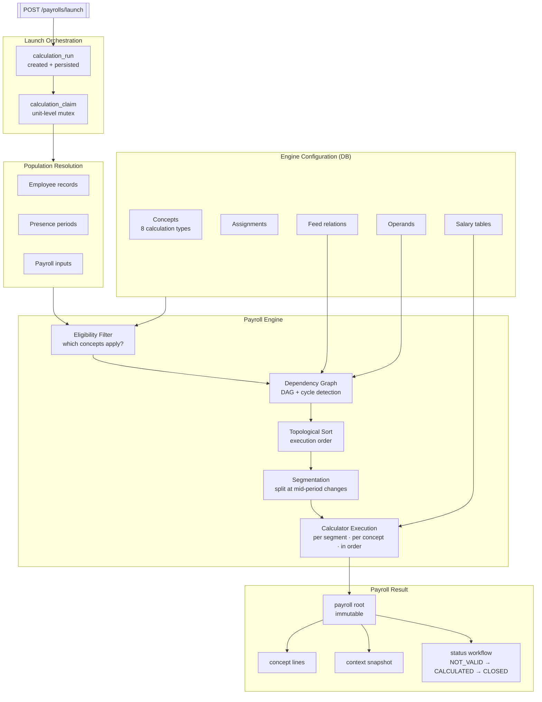

# B4RRHH — HR & Payroll Engine

> A personnel administration system and configurable payroll engine built around domain-driven design, hexagonal architecture, and temporal data integrity — with zero tolerance for shortcuts.

---

## What problem does this solve?

HR and payroll systems tend to collapse under one of two failure modes:

- **Over-engineering early**: event buses, microservices, CQRS — before the domain is understood.
- **Under-engineering late**: CRUD controllers that accumulate business logic until the system is unmaintainable.

B4RRHH takes a different path. It models **the actual domain** — employee lifecycle, temporal employment data, a graph-based payroll calculation engine — before introducing any infrastructure abstraction. The architecture follows from the domain, not from a framework tutorial.

---

## Architecture at a glance

```
bounded context → vertical (domain slice) → hexagonal layer
```

```
com.b4rrhh.employee.contract.application.usecase.ReplaceContractFromDateService
           ^^^^^^^^ ^^^^^^^^ ^^^^^^^^^^^
           context  vertical     layer
```

Two bounded contexts:

| Context | Verticals |
|---------|-----------|
| `employee` | employee, presence, contact, address, identifier, contract, labor\_classification, cost\_center, work\_center, working\_time, payroll\_input |
| `rulesystem` | company, company\_profile, work\_center, catalog\_binding, catalog\_option, rule\_entity |

Hard rules enforced throughout:
- Domain classes have **zero** Spring or JPA imports
- Business logic never touches controllers or repositories
- APIs expose **business keys only** — no surrogate IDs, ever

---

## The Payroll Engine

This is the core of the system. It is not a calculator. It is a **configurable, graph-based execution engine** for payroll concepts.

### Eight modules with clear responsibilities

```
payroll_engine/
├── concept      — concept catalog: calculation type, operands, feed relations
├── object       — payroll objects (assignable salary tables)
├── table        — salary value lookup tables
├── eligibility  — determines which concepts apply to a payroll unit
├── dependency   — builds the DAG of concept dependencies with cycle detection
├── planning     — resolves topological execution order
├── segment      — splits the calculation period at intra-period changes
└── execution    — runs calculators per segment, accumulates results
```

### Calculation types

Every payroll concept declares exactly how it computes its value:

| Type | Description |
|------|-------------|
| `DIRECT_AMOUNT` | Fixed amount from salary table lookup |
| `RATE_BY_QUANTITY` | Rate × quantity (e.g. hours worked) |
| `PERCENTAGE` | Percentage of another concept's result |
| `AGGREGATE` | Sum of other concepts |
| `ENGINE_PROVIDED` | Value injected by the engine (SS group, payroll type) |
| `EMPLOYEE_INPUT` | Employee-declared value (e.g. voluntary pension) |
| `GREATEST` | max(computed, floor) — used for SS contribution floors |
| `LEAST` | min(computed, cap) — used for SS contribution caps |

### Execution flow

```
Payroll Unit
    │
    ▼
Eligibility Filter          ← which concepts apply to this employee?
    │
    ▼
Dependency Graph Build      ← DAG construction, cycle detection
    │
    ▼
Topological Sort            ← resolves execution order across the graph
    │
    ▼
Segmentation                ← splits month at mid-period changes
    │  (contract change on the 15th → two independent segments)
    ▼
Calculator Execution        ← runs per segment, per concept, in dependency order
    │
    ▼
Result Accumulation         ← merges segments into final payroll totals
```

No concept executes before its dependencies. No hardcoded payroll logic anywhere in the codebase.



### Concurrent safety

Payroll launches are protected by an explicit domain model — not a `synchronized` block:

- **`calculation_run`** — persisted record of a launch: population, progress, status
- **`calculation_claim`** — unit-level mutex; two concurrent runs cannot calculate the same payroll unit

---

## Temporal data integrity

Most employee data is historized. The system enforces this without exception.

### Strong Timeline Replace

A reusable pattern (`StrongTimelineReplacePlanner`) governs any `replaceFromDate` operation across all temporal verticals:

```
Existing periods:     [Jan ─────────── Jun] [Jul ─────────── Dec]
replaceFromDate(Mar):
Result:               [Jan ── Feb] [Mar ──── Jun] [Jul ─────────── Dec]
                                    ^^^^^^^^^^^^
                                    new period, boundaries recalculated
```

Three outcomes — all handled, none silently ignored:

- **Exact match** — new period replaces existing at the same start date
- **Split** — existing period is divided; new period takes over from effective date
- **No coverage** — rejected; gaps in the timeline are a domain error

This same logic governs contracts, labor classifications, cost centers, work centers, and working time.

---

## Employee lifecycle as explicit workflows

Creating an employee is not a POST to `/employees`. It is a **Hire workflow** that coordinates multiple verticals atomically:

```
HireEmployee
├── create employee record
├── open presence period
├── assign contract
├── assign labor classification
├── assign cost center
├── assign work center
└── assign working time
```

`TerminateEmployee` and `RehireEmployee` follow the same discipline. Each workflow enforces cross-vertical consistency and temporal rules that cannot be expressed as independent CRUD operations.

---

## API design

The API operates entirely on **functional identifiers**:

```http
GET  /employees/{ruleSystemCode}/{employeeTypeCode}/{employeeNumber}/contract
PUT  /employees/{ruleSystemCode}/{employeeTypeCode}/{employeeNumber}/labor-classification/replace-from-date
GET  /payrolls/{ruleSystemCode}/{employeeTypeCode}/{employeeNumber}/{payrollPeriodCode}/{payrollTypeCode}/{presenceNumber}
```

No `id` path variable exists anywhere in this API. This is intentional and documented in [ADR-001](docs/architecture/adr/ADR-001-vertical-architecture-and-api-identity.md).

---

## Architecture Decision Records

Every non-obvious decision is documented. There are currently **31 ADRs** covering:

- Vertical architecture and API identity strategy
- Employee business key design
- Rule entity metamodel
- Employee lifecycle workflows
- Strong timeline replace pattern
- Employee journey model
- Cost center design
- Company as enriched, rule-anchored catalog
- Payroll status workflow and state machine
- Payroll root model (immutable result, not editable record)
- Concurrent launch orchestration with calculation\_run and claim
- Hierarchical authorization model
- UI interaction contracts per vertical

Full bundle: [`docs/architecture/adr/ADR_BUNDLE.md`](docs/architecture/adr/ADR_BUNDLE.md)

---

## Domain coverage — Spain, Régimen General

The system models real Spanish HR and payroll law through the concept graph — nothing hardcoded:

- **Grupo de cotización** (SS contribution group, 1–11) — drives salary tables and contribution rates
- **SS employer contributions**: contingencias comunes, desempleo (empresa), FOGASA, formación profesional, MEI
- **SS worker deductions**: CC trabajador (4.70%), desempleo (1.55%), FP (0.10%), MEI (0.10%)
- **IRPF withholding** with configurable rates per employee
- **Convenio colectivo** — agreement category profiles with real salary tables
- Topes de cotización (contribution floors and caps via `GREATEST` / `LEAST`)

---

## By the numbers

| Metric | Value |
|--------|-------|
| Java source files | ~1,400 |
| Test files | ~270 |
| Flyway migrations | 91 |
| Architecture Decision Records | 31 |
| Payroll engine modules | 8 |
| Calculation types | 8 |
| Bounded contexts | 2 |
| Employee domain verticals | 11 |

---

## Running the project

**Requirements:** Java 21, Docker

```bash
# 1. Start PostgreSQL
cd docker/postgres && docker compose up -d

# 2. Run the application (Flyway migrations run automatically on startup)
mvn spring-boot:run  -Dspring-boot.run.profiles=local

# 3. Run all tests (H2 in-memory — no Docker required)
mvn test

# Run a specific test class
mvn test -Dtest=CalculatePayrollUnitServiceTest
```

Credentials: `b4rrhh / b4rrhh` at `localhost:5432/b4rrhh`

---

## Project structure

```
src/main/java/com/b4rrhh/
├── employee/           ← 11 domain verticals
├── rulesystem/         ← catalog and configuration management
├── payroll/            ← payroll domain (launch, run, claim, result)
├── payroll_engine/     ← 8-module graph-based calculation engine
├── authorization/      ← JWT + role-based access (ADMIN, HR_MANAGER, HR_VIEWER)
└── shared/             ← minimal cross-cutting abstractions

src/main/resources/
└── db/migration/       ← 91 Flyway migrations (schema evolution + seed data)

openapi/
└── personnel-administration-api.yaml   ← source of truth for the API contract

docs/
└── architecture/adr/   ← 31 Architecture Decision Records
```

---

## Tech stack

- **Java 21** — records, sealed classes, pattern matching
- **Spring Boot 3.3** — web, data JPA, security
- **PostgreSQL** — primary store
- **Flyway** — schema versioning and seed data
- **Docker** — local database
- **H2** — test isolation (no external dependencies in CI)

---

## Status

Active development. The payroll engine is the current focus: concept graph construction, segmentation, and real SS/IRPF calculations are working. The launch orchestration model (`calculation_run` + `calculation_claim`) is designed and partially implemented.

This is a solo project. The pace is deliberate — correctness over speed.

---

## Why this exists

Most HR backends I have seen were either too simple (CRUD over employee tables) or too complex (event sourcing, CQRS, microservices) for a domain that doesn't need that complexity yet.

This project is an exploration of what it looks like to model a genuinely complex domain — temporal employment data, payroll calculation graphs, lifecycle workflows — with enough discipline that the system stays comprehensible as it grows.

The answer, so far: vertical slices + hexagonal architecture + explicit temporal patterns + documented decisions.

---

## License

This project is distributed under a **Business Source License (BSL)**.

Source code is publicly visible for learning, evaluation, and non-commercial use.  
Commercial use — including SaaS, hosted services, or revenue-generating products — is **not permitted** without an explicit commercial license.

See [`LICENSE.md`](LICENSE.md) for full terms and [`NOTICE.md`](NOTICE.md) for authorship details.

For commercial licensing inquiries, contact the author.
