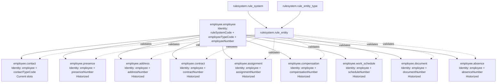

# B4RRHH — Employee Domain Conceptual Diagram

```mermaid
flowchart TD
    E[employee.employee\nIdentity:\nruleSystemCode + employeeTypeCode + employeeNumber]

    P[employee.presence\nIdentity: employee + presenceNumber\nHistorized]
    C[employee.contact\nIdentity: employee + contactTypeCode\nCurrent slots]
    A[employee.address\nIdentity: employee + addressNumber\nHistorized]
    CT[employee.contract\nIdentity: employee + contractNumber\nHistorized]
    AS[employee.assignment\nIdentity: employee + assignmentNumber\nHistorized]
    CP[employee.compensation\nIdentity: employee + compensationNumber\nHistorized]
    WS[employee.work_schedule\nIdentity: employee + scheduleNumber\nHistorized]
    D[employee.document\nIdentity: employee + documentNumber\nHistorized]
    AB[employee.absence\nIdentity: employee + absenceNumber\nHistorized]

    RS[rulesystem.rule_system]
    RET[rulesystem.rule_entity_type]
    RE[rulesystem.rule_entity]

    E --> P
    E --> C
    E --> A
    E --> CT
    E --> AS
    E --> CP
    E --> WS
    E --> D
    E --> AB

    RS --> RE
    RET --> RE

    RE -. validates .-> C
    RE -. validates .-> P
    RE -. validates .-> A
    RE -. validates .-> CT
    RE -. validates .-> AS
    RE -. validates .-> CP
    RE -. validates .-> WS
    RE -. validates .-> D
    RE -. validates .-> AB
```
